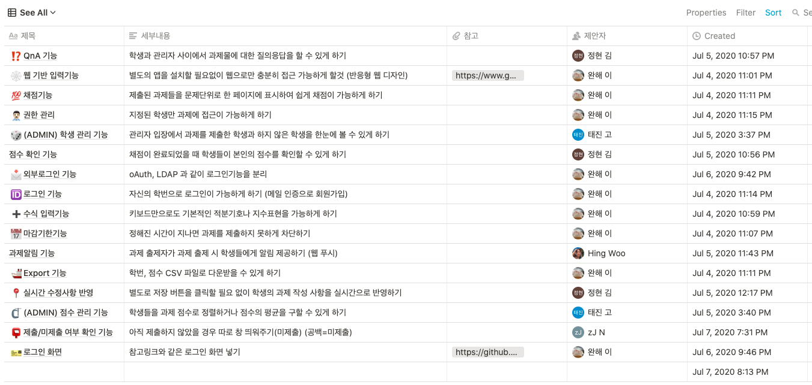
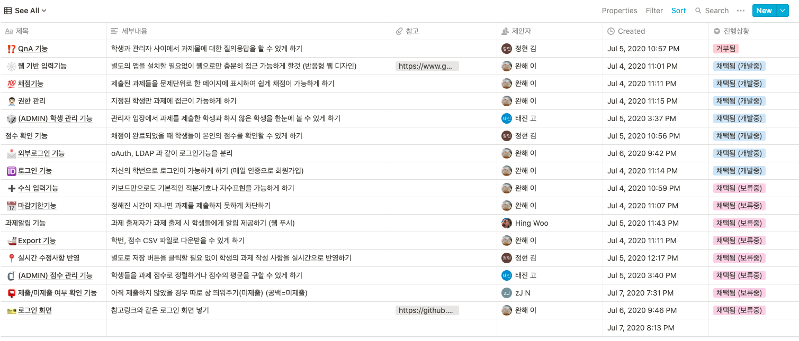
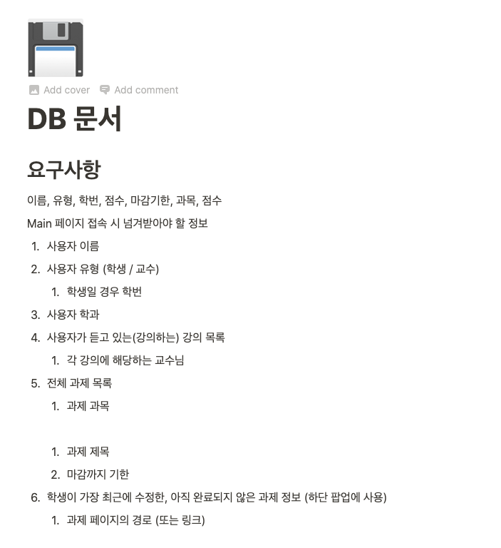
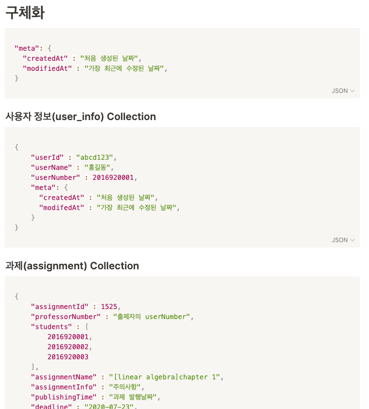

CSUOS 프로젝트들이 잘 진행되기위해서 그라운드 룰이 존재합니다. 각 프로젝트들은 프로젝트 상황에 따라 그라운드룰을 기준으로 변형을 해 진행합니다.

CSUOS는 프로젝트 진행단계에 따라 Agile 방법론을 조금식 변형하여 적용합니다.

## 기획단계

프로젝트의 방향성을 정하고 프로젝트 인원을 전부 모집한 단계입니다. 먼저 진행해야할 일은 뭘 만들까 입니다. 먼저 다음작업을 진행합니다.

1. [1주차] 1주일이라는 기간동안 팀원 각자가 추가하면 좋을꺼 같은 기능들을 전부 리스트에 적어두기

2. [1주차] 다 같이 위 리스트의 각항목을 다음 세가지 항목으로 구분합니다.

   1. 지금 당장 구현 할 기능

   2. 필요하지만 천천히 구현 할 기능

   3. 구현 안할 기능

      

   > 여기서 지금 당장 구현할 기능은 이 프로젝트를 사용하기위한 "최소한"의 기능을 의미합니다. 이 기능이 존재하지 않으면 프로젝트가 의미가 없어지는 기능들을 의미합니다.
   >
   > 최소한의 기능들을 제외한 나머지 기능들은 "아무리 재미있어보여도" 지금 당장의 개발에서 제외합니다.

3. [2주차] 최소한의 기능들을 전부 표현하고 있는 UI 만들기.

   1. https://ovenapp.io/view/E21BDvmDkuNkKEl8bPn6jtOANjBX5oU7/eQEHL
   2. Kakao의 Oven을 사용하는것을 추천합니다. (광고아님)

4. [3주차] 각 UI 구성요소가 필요로 할 데이터들을 파악하고 어떤 API가 필요할지 정리하기. -> OpenAPI 작성

   1. https://github.com/CSUOS/nera/blob/7e9ae6886fd626a8b3bb03e57a0487147aa28f74/server/README.md

5. [3주차] 각 API를 서비스하기 위해 데이터베이스를 어떻게 구성해야할지 정하기.

   1. 
   2. 

6. [3주차] 프로젝트를 진행하기 위해 사용할 언어, 프레임워크 등을 정하기

   1. 규격을 갖춘 프로그래밍을 위해 OpenAPI를 통해 코드를 생성

7. [4주차] git 레포지터리를 생성하고 해당 프레임워크를 활용해 자동으로 생성된 코드를 init이라는 제목으로 커밋하기.

## 프로토타입 개발 단계

최소한의 기능을 갖춘 프로젝트를 완성하기위한 프로토타입 개발단계입니다.

개발은 노션, 트렐로, 지라등의 플랫폼에서 제공하는 칸반보드를 사용합니다.

칸반보드는 총 세개의 Column이 필요합니다.

| 이름        | 내용                                                         |
| ----------- | ------------------------------------------------------------ |
| To DO       | 프로젝트 진행을 위해 행해져야하는 작업입니다. 각자가 어떤 작업이 필요하다고 느낄때마다 작성하여 채워넣습니다. |
| In Progress | To Do에 정해진 작업을 진행중이면 자신을 담당자로 선택해 이곳에 옮깁니다.  이는 같은 작업을 중복하지 않게 행하기위해 중요합니다.  To Do에서 작업을 옮길때는 Deadline도 본인이 직접 정해야합니다. |
| Done        | 다 끝난 작업은 여기로 옮깁니다.                              |

* 브랜치 규칙
  * master
    * master에 존재하는 모든 커밋은 모든 기능이 온전하게 작동된다는게 보장되어야 합니다.
    * (어떤 커밋이든 실행하면 정상적으로 로그인이 가능해서 구현된 모든 기능은 이용이 가능해야함)
    * master는 무조건 PR을 통해서만 merge 합니다.
  * draft
    * 이곳에는 직접적인 커밋을 행하지 않고, 각 기능이 완성될때마다 PR혹은 merge 합니다.
    * draft의 모든 기능이 온전히 작동할때는 master로 Pull Request 을 넣은 후 코드 리뷰 후 머지합니다.
  * 그 외 브랜치
    * 자유롭게 이용합니다.
* PR 규칙
  * 최대한 자주 넣습니다.
  * PR을 오랫동안 놓지 않으면 자동 merge가 안될 확률이 높으니 주의하셔야합니다.

프로젝트 진행상황은 1주일 단위로 갱신하며, 1주일에 1회 온라인 혹은 오프라인으로 미팅을 진행합니다. 미팅 전에 다음과 같이 각자 미팅때 다룰내용을 정리합니다.

> * <<이름>>
>   * 저번주에 한 것
>     * 기능 A 개발
>     * 기능 B 버그수정
>     * XXX 아키텍쳐 변경
>   * 이번주에 할 것
>     * 기능 C 개선
>     * 기능 D 개발
>     * DB 구조 변경
>   * 논의하고 싶은 내용
>     * 기능 C를 Z처럼 하는게 좋을까요? 아님 X처럼 하는게 좋을까요?
>     * DB구조를 지금이라도 이전에 논의했던 내용대로 바꾸는건 어떨까요?
>     * 기능 E 개발이 언제까지 끝날까요?

미팅은 위와같이 미팅전 각자 정리한 내용들을 기준으로 진행합니다.

또한 매주 월요일과 목요일 정오에는 다음과 같이 단톡방에 자신이 뭘했고 뭘 할껀지 간단하게 남겨줍니다.

> 한 것
>
> * 기능 A 개발
> * 기능 C 개발
>
> 할 것
>
> * 다음주 시험기간이라 잠시 쉬겠습니다.

## 프로젝트 완성 단계

최소한의 기능이 완성되었으면 이제부턴 작업을 GitHub에서 시작합니다.

Github Project에 새로운 칸반보드를 생성하시고 모든 작업은 이슈 발행 후 진행합니다.

예시: https://github.com/orgs/CSUOS/projects/2