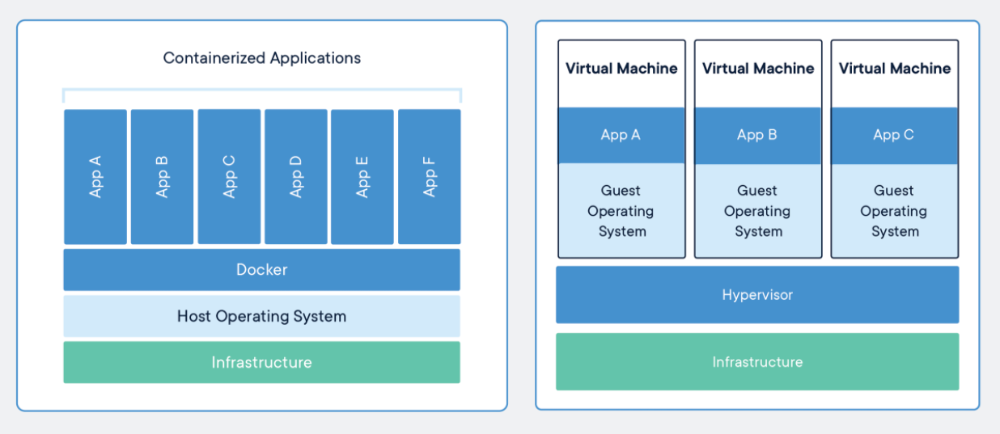
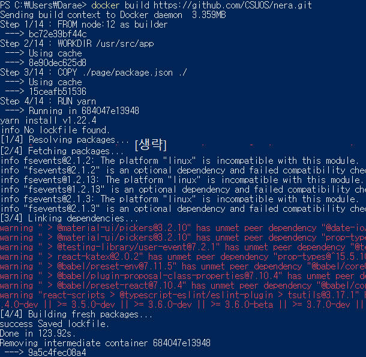
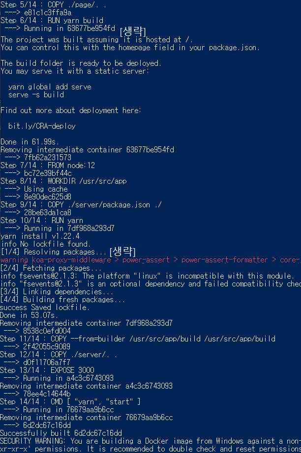
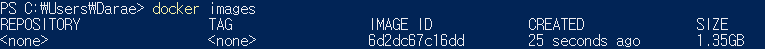
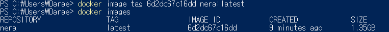

---
title: "Nera 와 Rabums 의 Dockerfile 분석하기"
date: 2020-09-13
slug: "/dockerfile-analysis"
---

안녕하세요, CSUOS 의 DevOps 팀원인 장다래입니다.


리눅스 공부를 하면서 가상머신을 설치해 보셨다면... 도커가 얼마나 편리하고 간편한 도구인지 알 수 있습니다. VM(Virtual machines)은 전체 운영체제를 복사해서 물리적으로 하드웨어 위에 설치하는 것이기 때문에, 엄청난 용량과 느린 부팅 속도를 갖고 있었죠.


###### 출처 [https://www.docker.com/resources/what-container](https://www.docker.com/resources/what-container)


하지만 도커의 컨테이너는 운영체제를 직접 가져오는 것이 아니라 원하는 환경의 설정과 패키지 코드를 추상화해서 컨테이너로 만든 것입니다(~~정확한 컨테이너 작동 방법은 저도 잘 모르겠습니다~~). 어쨌든 기존 VM 보다 빠르고 가볍다는 장점이 있죠.

그리고 이때, **Dockerfile** 은 도커 컨테이너를 만들기 위해 필요한 설정 파일입니다. Nera 와 Rabums 프로젝트의 Dockerfile 을 살펴보면서, 도커에 익숙해져 봅시다.

## Docker 컨테이너 생성하기

도커 컨테이너를 만들기 위해서는 **도커 이미지**를 필요로 하는데, 도커 허브에서 이미지를 다운 받거나, Dockerfile 에 작성된 설정을 통해 직접 이미지를 생성할 수도 있습니다. 

### 깃허브 Dockerfile 로 이미지 빌드하기
`docker build https://github.com/CSUOS/nera.git` 명령어를 입력하고 `docker images`를 통해 이미지가 생성되었는지 확인해봅니다. 
이미 레포지토리를 받아놨다면, Dockerfile 이 있는 폴더에서 `docker build .` 명령어를 입력합니다.
다양한 옵션을 주고 싶다면 [여기](https://docs.docker.com/engine/reference/commandline/build/)를 참고해주세요.

Dockerfile 안의 명령을 인스트럭션이라고 하는데, `FROM`, `COPY`, `RUN` 등으로 설정을 변경할 수 있습니다. 

하나의 인스트럭션을 실행할 때마다, 도커 이미지(Layer)를 생성하고 임시 컨테이너에서 실행하는 과정을 반복합니다. 단계 마다 생성된 임시 컨테이너는 삭제되고, 최종적으로는 하나의 이미지가 생성됩니다. (아래에서 더 자세히 살펴볼게요!)

### 도커 허브에서 이미지 가져오기
이미지를 생성하는 데에는 Dockerfile 을 통한 빌드 외에도 도커허브에서 가져오는 방법이 있습니다. 
`docker pull csuos/nera` 를 입력하면, csuos 라는 도커 허브 유저의 nera 레포지토리를 가져온다는 의미입니다. 

### 도커 이미지로 컨테이너 실행하기
`docker images`를 통해 불러온 이미지 목록을 확인해 봅시다. Dockerfile 로 이미지를 빌드하거나, 허브에서 이미지를 가져왔다면 컨테이너를 실행하는 일만 남았습니다.
 이미지로 컨테이너를 실행하기 위해서는 `docker run csuos/nera` 를 입력합니다. `docker ps` 를 통해 현재 실행 중인 컨테이너 목록을 확인할 수 있습니다.
`docker run` 과 관련된 옵션도 다양합니다. [참고](https://docs.docker.com/engine/reference/commandline/run/)

만약 `csuos/nera` 이미지가 존재하지 않는다면, 도커는 자동으로 허브에서 이미지를 불러오고 실행하게 됩니다.

## Nera 의 Dockerfile

앞서 소개했듯이 이미지를 불러오는데에 몇 가지 방법이 존재하지만, 여기서는 `docker build` 를 통해 어떻게 Dockerfile 에서 이미지 레이어가 생성되는지 확인해 보도록 하겠습니다. 

```
# csuos/nera Dockerfile

FROM node:12 as builder
WORKDIR /usr/src/app
COPY ./page/package.json ./
RUN yarn
COPY ./page/. .
RUN yarn build

FROM node:12
WORKDIR /usr/src/app
COPY ./server/package.json ./
RUN yarn
COPY --from=builder /usr/src/app/build /usr/src/app/build
COPY ./server/. .

EXPOSE 3000
CMD [ "yarn", "start" ]
```
Nera 프로젝트는 `/page`에 프론트엔드 코드를, `/server`에 백엔드 코드를 작성하는 것으로 나눠서 관리되고 있습니다.  이런 특징은 Dockerfile 에서도 드러나는데요, `FROM` 을 기준으로 `./page`와 `./server` 에서 각각 `RUN yarn` 을 통해 필요한 모듈을 설치하고 있습니다.

* `FROM` 인스트럭션은 `node:12` 라는 [base image](https://docs.docker.com/glossary/#base_image)를 사용하는 것을 명시합니다. 따라서 모든 (base image를 제외한) Dockerfile 은 `FROM` 명령어로 시작해야 합니다.  `as builder`는 이후에 작성된 `FROM` 이나 `COPY` 에서 같은 base image를 사용할때, 일관성을 유지하기 위해 이름을 정해줍니다.

* `WORKDIR` 는 `COPY`, `RUN`, `CMD` 등 인스트럭션 실행을 위한 작업 폴더를 명시합니다. 

* `COPY` 는 다음과 같은 형식을 같습니다. 
	```
	COPY [--chown=<user>:<group>] <src>... <dest>
	COPY [--chown=<user>:<group>] ["<src>",... "<dest>"]
	```
	즉, `COPY ./page/package.json ./` 는 `./page/package.json` 의 내용을 컨테이너의 `./` 에 복사하게 됩니다. 

* `COPY --from=builder /usr/src/app/build /usr/src/app/build` 에 작성된 `--from=builder` 는, [multi-stage build](https://docs.docker.com/develop/develop-images/multistage-build/) 를 가능하게 하는 옵션입니다. 앞서 `node:12`를 `builder`로 지정했던 것이 기억 나시나요? 그 환경에서 파일을 가져와서 최종 이미지에 추가하는 역할을 하게 됩니다.

* `RUN` 은 shell 에서 사용하는 명령어를 작성하면, 그대로 실행하게끔 합니다.

* `EXPOSE` 에서는 도커 컨테이너가 어떤 포트에 반응할지를 작성해 놓은 것입니다. 하지만 실제로 포트에 연결하는 것은 아니고, 다만 의도하는 포트번호를 명시할 뿐입니다. 실제로 컨테이너와 포트를 연결하기 위해서는 `docker run -p 80:80` 처럼 컨테이너 실행시 연결을 해야합니다.

* `CMD` 는 컨테이너를 실행할때 제공하는 디폴트 실행 값을 의미합니다. Nera Dockerfile 에서는 `CMD [ "yarn", "start" ]`을 작성했기에, 컨테이너 실행 시 `yarn start`가 작동될 것으로 예상됩니다. 
	따라서 Dockerfile 에는 하나의 `CMD`만 있어야 하며, 만약 여러 개일 경우 마지막 `CMD`만 실행이 됩니다. 
	


아래부터는 깃허브에 작성된 Dockerfile 을 바탕으로 이미지를 빌드하는 과정을 나열해 보겠습니다.



`Step 1/14`에서 저는 이미 `node:12` 가 있어 설치가 진행되지 않은 것 같고, `docker images` 를 통해 확인해보면 `bc72e39bf44c` 가 `node:12` 아이디와 일치함을 알 수 있습니다.

`Step 2/14` 에서 `Using cache`가 보여지고, 밑에는 새로운 이미지 아이디가 표시됩니다. 이는 앞서 불러왔던 base image 인 `node:12` 가 담긴 컨테이너에서 `WORKDIR` 작업을 수행하고, 새로운 이미지(`FROM`  + `WORKDIR`)가 담긴 컨테이너를 새로 생성한 것입니다.  

다음 스텝에서도 cache 이미지를 사용하고, 새로운 이미지를 만들면서 최종 이미지 생성을 위해 여러 단계를 거쳐 이미지 레이어를 쌓고 있습니다.

`Step 4/14: Run yarn` 을 수행하고 생긴 `Running in 684047e13948` 이미지는 `RUN` 명령어가 끝나고 `Removing intermediate container 684047e13948` 에서 삭제됩니다.




나머지 인스트럭션을 실행한 후, `Successfully built 6d2dc67c16dd` 의 이미지 아이디는 Nera 프로젝트의 최종 이미지가 됩니다.

다음 그림에서 생성한 도커 이미지를 확인해보면 이미지 ID 가 `6d2dc67c16dd` 인 이미지를 확인할 수 있습니다.



임의로 레포지토리와 태그를 설정해주었습니다. (레포지토리 이름은 csuos/nera 처럼 유저이름이 앞에 있는게 좋아요. 아래 그림은 잘못된 예입니다. 유저이름이 붙지 않은 레포지토리-*ubuntu:14.04 처럼*-는 오피셜 레포지토리에 사용한다고 합니다. )




## Rabums 의 Dockerfile

Rabums 프로젝트는 Dockerfile 만 살펴보도록 하겠습니다.

```
# csuos/rabums Dockerfile

FROM node:12 as nuxt-builder
WORKDIR /usr/src/app
COPY ./rabums_view/package.json ./
RUN yarn
COPY ./rabums_view/. .
RUN yarn generate

FROM golang:1.14 as go-builder
WORKDIR $GOPATH/src/github.com/CSUOS/rabums
COPY . .
RUN GO111MODULE=on CGO_ENABLED=0 GOOS=linux GOARCH=amd64 go build -v -mod=readonly -o /go/bin/rabums cmd/*.go

FROM alpine:3.11.3
RUN apk update && apk add ca-certificates && rm -rf /var/cache/apk/*

COPY --from=go-builder /go/bin/rabums /bin/rabums
COPY --from=nuxt-builder /usr/src/app/dist/. /dist/.

CMD ["/bin/rabums"]
```

Rabums 프로젝트는 `FROM` 인스트럭션이 3개네요. 각각 `node:12`, `golang:1.14`, `alpine:3.11.3`을 사용하고 있습니다. 각각의 이미지에서 작업 폴더를 설정(`WORKDIR`)해 필요한 파일들을 복사(`COPY`)하고 실행(`RUN`)하는 것을 알 수 있습니다. 

`RUN apk update && apk add ca-certificates && rm -rf /var/cache/apk/*` 처럼 여러개의 `RUN` 인스트럭션을 사용하는 대신,  `&&` 를 사용해 이미지 레이어 생성과정을 줄인 점도 눈여겨 볼 수 있습니다.

마지막 두 줄의 `COPY` 인스트럭션에서는 앞서 작업한 `node:12`와 `golang:1.14` 이미지에서 작업했던 결과를 `alpine:3.11.3` 의 이미지에 추가하여 하나의 파일을 만들고 있습니다. `COPY --from=go-builder /go/bin/rabums /bin/rabums` 에서는 `/go/bin/rabums`에서 하나의 바이러니 파일만 `/bin/rabums` 에 옮기고, `COPY --from=nuxt-builder /usr/src/app/dist/. `에서는 `/usr/src/app/dist/.` dist 폴더의 파일들(js, html, 등등..)을 `/dist/.`로 옮겨 최종 이미지를 만들게 됩니다. 

앞의 Nera 에서도 multi stage build 를 통해 다른 작업 환경의 결과물을 이미지에 추가했는데, 왜 이렇게 해야할까요? 자세한 내용은 [여기](https://docs.docker.com/develop/develop-images/multistage-build/)에서 확인할 수 있지만, 간단하게 설명해보겠습니다. 

도커 17.05 이전 버전에서 여러 작업 환경의 결과물들을 하나로 합치려면 여러 개의 인스트럭션을 사용해야 했습니다. 앞서 설명했듯이, 인스트럭션 하나당 컨테이너 하나를 생성하고 이미지를 커밋하는 과정이 필요하기 때문에, 용량도 커지고 속도도 느려지게 되는 것이지요. Nera 나 Rabums 에 사용된 multi stage build 는 이런 단점을 보완하기 위해 캐시를 통해 이미지를 빌드합니다. 덕분에 최종 이미지 크기를 줄이고, 속도도 향상되어 이미지를 빌드할 수 있게 됩니다.

## Dockerfile 작성을 할 때.. 

글을 살펴보았을 때, Dockerfile 을 작성하기 위해선 **효율성**에 중심을 두어야 한다는 걸 알 수 있습니다. 인스트럭션을 적게 사용해야하고, 많이 사용할 경우 `&&` 을 사용해 한 줄의 명령어로 해결할 수 있도록 해야합니다. 또한 multi stage build 를 통해 파일을 캐싱할 경우 더 적은 용량으로 이미지를 만들 수 있습니다. 

이번 글을 통해 Dockerfile 과 Docker 에 대한 이해를 도왔기를 바라며, 이만 글을 마치겠습니다. 😉

