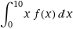
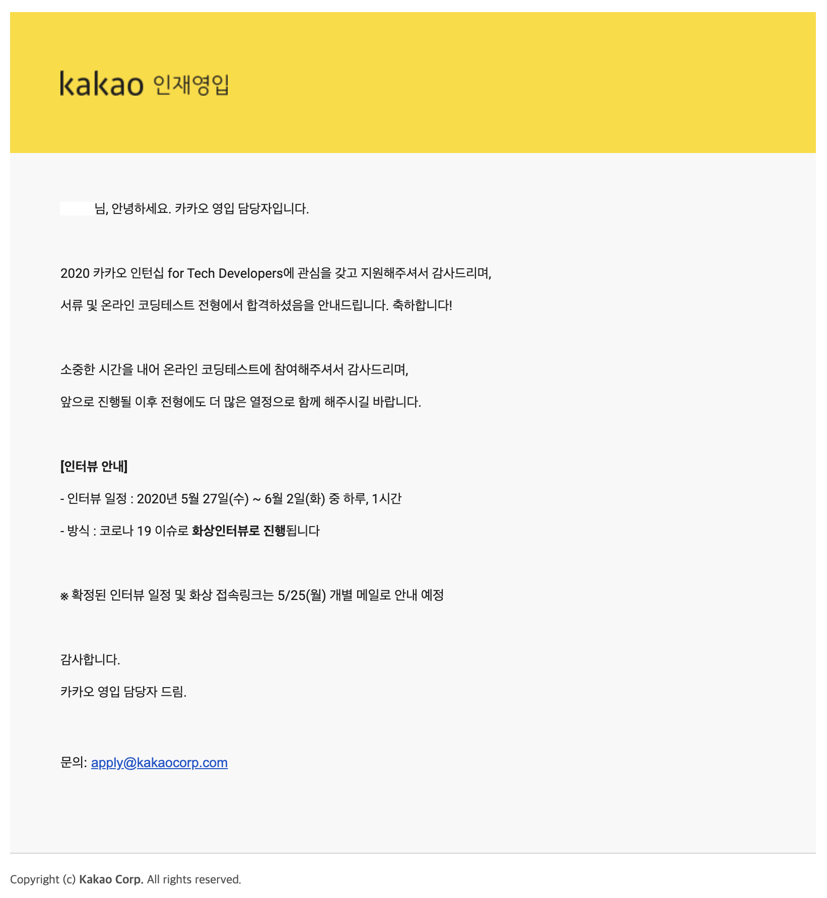

안녕하세요 2020년 현재 서울시립대학교 컴퓨터과학부  3학년 "괴물사냥꾼세계"입니다. 

저는 2020년 5월 카카오 채용연계형 여름인턴에 지원하였으며 운좋게도 합격하여 2020년 7월 1일부터 8월 31일까지 인턴 생활 후 9월 1일 최종 면접에 합격하여 2020년 9월 현재 학업과 직장을 병행중입니다. 

 이 글은 졸업하면 소통이 단절되고, 개인플레이 위주로 각자 알아서 살길을 찾아가는 (혹은 제가 그렇다고 느끼는) 서울시립대 컴퓨터과학부에 글이라는 형태로 정보를 공유하는 문화를 만들고자 작성합니다. 성공담도 좋고, 실패담도 좋고, 매우 개인적인 생각을 밝혀주셔도 좋습니다. 이 글을 읽는 여러분도 다른 학우분들이 알면 좋은 싶은 글을 올려주세요. :-)

> 글을 작성하는법은 
>
> https://github.com/CSUOS/csuos.github.io
>
> 를 참고하세요!

일단, "카카오 인턴 및 정규직 전환 후기" 란 제목으로 글을 시작하였으니 카카오에 지원하게된 계기부터 최종면접까지의 과정을 글로 남겨보겠습니다. 지극히 개인적이고 주관적인 입장에서 작성하는 글이지만 여러분에게 도움이 되면 좋겠네요. ;-)

글은 총 3부작으로 작성할 예정입니다. 첫번째 글인 지금 이 글은 인턴 뽑히기 전까지의 과정, 두번쨰 글은 인턴으로 활동하면서 있었던일, 세번째 글은 전체적으로 하고싶은 말에 대해서 적을 예정이니 기대해주세요. :-)

### 카카오를 지원하게된 계기

저는 [HCAIL](http://hcail.uos.ac.kr) 연구실에서의 경험들이 카카오 인턴을 지원하는데 큰 계기를 주었다고 생각합니다. 뭐..... 툭까놓고 말씀드리자면 연구실 활동을 하면서 정 교수님이 수많은 사람들과 경험들로 제 기존 가치관과 고정관념을 무자비하게 뿌셔버리고 새로운 세계와 길을 제안해주셨고 이에 감명받아 적극적으로 이것저것 해보기 시작했죠. 이에 관한 내용은 나중에 기회가 된다면 글로 밝혀보고자 합니다.

 그렇게 이것저것 해본것중 첫번째가 구글, 아마존, 페이스북, 드롭박스 등의 미국 거대 IT기업들의 인턴 도전이었습니다. 미국은 한국과 달리 학생을 대상으로하는 인턴 문화가 널리 퍼져있습니다. 여기서 제가 노른것은 Summer Internship이며. 간단히 소개를 해드리자면 여름방학동안에 학생들을 대상으로 3개월동안 진행하는 한국의 "체험형 인턴"이라고 생각하시면 됩니다. 단, 한국과 다른점이 있다면 스케일이 다르죠. 회사마다 다르긴 하지만 인턴월급이 보통 시급 30~50달러, 월급으로치면 5000 ~ 8000 달러정도 됩니다. 여기에 보통 대부분의 회사가 여행경비와 주거비를 지원하기때문에 돈걱정만큼은 1도없이 회사를 다닐 수 있으니, 돈내고 해외유학가는것 보다는 돈받고 해외 회사다니는게 저로써는 많은점에서 유리하다고 생각했습니다.

 물론, 결론은 실패했습니다. Summer Internship은 전년 10월 말에 지원서를 받는데, 이때는 제가 연구실에 들어가서 뭔가 해보기 시작한지 1달정도밖에 안지났던 시점이라 이력서도 부실하고, 채워넣을 내용도 없었으며 해외 인사과 담당자들에게 어필할 그 무엇도 없었고 결국 30여개의 회사에 지원서를 뿌렸으나 전부 서류수준에서 탈락해버렸습니다. (뭐 애초에 큰 기대를 한것도 아니였긴 하지만요)

 그렇게 저는 2021년 Summer Internship을 위해서 2020년 10월까지 여러 활동을 하며 이력서에 채워넣을 수 있는 활동들을 이것저것  하기로 계획을 세웠습니다. 그러다, 2020년 5월경 카카오 인턴쉽 공고를 보고 "되면 좋고, 안되면 말고" 라는 기분으로 카카오에 지원을 하게됩니다.

### 카카오 지원서 작성

카카오는 자체 제작한 홈페이지에서 이력서를 받습니다. 프로젝트 경력, 경력, 자격증, 어학성적, 마지막으로 자기소개소를 써줄것을 요청받았습니다. 이력서에 제가 뭐라고 썼는지는 CSUOS팀에 들어오시면 알려드리겠습니다. :-)

### 첫번째 관문, 코딩테스트

카카오 코딩테스트는 프로그래머스를 통해 토요일 오후 2시부터 오후 6시간까지 4시간동안 진행되었습니다. 문제가 있었다면, 그날이 학교 수업 보강날짜였고, 3시부터 6시까지는 수업을 들어야 했습니다. 물론 코로나시국으로 인한 원격수업이라서 비밀스러운 얘기로는 틀어놓고 딴짓을해도 크게 문제가 되지는 않았겠지만 그래도 뭔가 안듣기는 찝찝하고 듣자니 안타까워서, 딱 한시간동안만 코테를 풀고 나머지 3시간동안은 수업을 듣기로 결정했습니다.

코테를 처음봤을때 문제는 예고대로 총 5문제였으며 자세한 문제 및 풀이법은 [카카오에서 이미 공개](https://tech.kakao.com/2020/07/01/2020-internship-test/)했으니 이 글에서는 당시 제가 뭘 했는지만 밝혀보도록 하겠습니다.

일단 문제를 받고 처음으로 한일은 5문제가 어떻게 나왔는지 확인하는 일이였습니다. 당시 저는 10분동안 각 문제에 대해 다음과 같이 평가를 내렸습니다.

> 1번 문제
>
> ​	노가다 시뮬레이션 문제. 그냥 하라는데로 if else로 만들면 됨
>
> 2번 문제
>
> ​	중위연산자 문제? 후위연산자로 변환 후 스택쓰라는건가? 어? 아닌데? 흠...... (고민중)..... 아, 이거 학교에서 배운대로 하면 구현하기가 더 빡칠꺼 같은데? 그냥 연산자별로 우선순위 해결하라는 문제니깐 앞에서부터 하나씩 검증해가면서 1순위 연산자, 2순위 연산자, 3순위 연산자 순서대로 해결하고 결과 저장하는 방식으로 가는게 쉬울듯. 어차피 6번씩만 해보면 끝이니깐.
>
> 3번 문제
>
> ​	아, 이거 기초문제네. 개이득
>
> 4번 문제
>
> ​	몬데 이거? 어캐풀라는거여?
>
> 5번 문제
>
> ​	그래프문제네. 디버깅 빡세겠다.

그렇게 1, 2, 3번 문제는 40분동안 순식간에 풀었고, 4번 문제는 고민도 안하고 버렸고, 5번 문제는 꽤 고민하다가 수업이 시작되서 수업 들으면서 겸사겸사 어떻게 지저분하게 구현해서 부분적으로 패스했습니다. (어떻게 했는지는 저도 모르겠네요 ㅎ) 나중에 안 사실이지만 4번 문제는 최단경로관련해서 매우 기초적인 문제였다고 하네요.

알고리즘 문제를 풀고난 이후 감상은 모든 문제가 알면 풀고 모르면 못푼다 식의 유형들이었다는 것입니다.

수학으로 비유하자면

위 문제와 같은 느낌이었습니다. 위 문제는 부분적분을 알면 그냥 바로 풀 수 있는 문제이고, 부분적분을 모르면 매우 엄청 많이 고생고생하다가 어렵게 풀어놓고는 계산실수로 틀리는 문제입니다. 카카오는 이번에 1번부터 4번까지는 부분적분과 같이 알면 풀고 모르면 틀리는 유형의 문제를 넣어놨고, 5번문제는 "풀어내면 너 면접볼때 조금 더 좋게 봐줄께" 정도 느낌이었습니다.

>  알고리즘의 기초유형들을 파악하고싶으시다면 개인적으로 [leetcode](https://leetcode.com/) 라는 사이트에서 `Golang`으로 문제를 풀어보시는것을 추천해드립니다. 
>
> 푸는게 전부가 아닌 풀고나서 괴수들이 풀어낸 최상의 형태의 코드들도 한번씩 감상해보세요. (`Golang` 쓰는사람들은 이미 개발철학이 완성된 사람들일 확률이 높아요. 알고리즘 뿐만아닌 코드 그 자체도 보고 배우기 좋습니다. Python, Java는 성능만 좋은 어중이떠중이가 너무 많아서 고수들의 코드가 묻혔죠.....) 

개인적으로 드리고싶은 말씀은, 대부분의 회사에서 출제하는 알고리즘 문제는 그 누구도 풀지못했고 여러분들의 창의력을 확인하려고 출제하는 문제들이 아닙니다. "모든 문제"가 명쾌한 해답이 존재하고, 단지 여러분이 그 해답을 알고있는지만 체크해서 Minimum qualification을 충족하는지 확인하려는 용도입니다.

> 대부분이라고 말씀드린 이유는 카카오 공채는 조금 예외이기 때문입니다. 카카오 공채 1차 코테는 여러분들의 알고리즘 지식 유무를 판단하려는 용도가 강하고, 2차 코테는 여러분들의 문제해결능력을 판단하는 용도입니다. 여기서는 문제를 정의하고 가장 쉬운방법으로 해결하는 방법을 제시하여 구현까지 가는 모든 과정을 테스트해봄으로 여러분들의 개발능력 및 경험을 확인합니다.

현재 많은분들이 코딩테스트가 입사에 필요한 전부라고 생각하고 필요 이상의 노력을 코테에만 투자하고 계시는데, 개인적으로는 아쉬울 뿐입니다. 저는 카카오 코테를 통과한 사람들중에서 매우 하위권에 속했었고, 저랑 같은 부서를 지원한 모 대학의 어떤 여학생분은 제가 3.5문제를 풀동안 5문제 완벽하게 풀어서 제출했다고 하는데 아쉽게도 인턴 면접에서 탈락했다고 하네요. 이와 관련된 내용을 섹션에서 밝혀보려고 합니다.

### 두번째 관문, 인턴 면접

3주정도 뒤에 카카오 신경도 안쓰고있었는데 갑자기 메일이 한통 날라왔습니다.

이 나쁜회사는 면접본다고 바로 직전주 금요일 저녁에 알려주더라고요.....;;;; 

 그래도 한가지 재미났던점은 면접보는 주 월요일 점심쯤 제 링크드인에 알림이 울리더라고요. 그래서 뭔가해서 봤더니만 카카오 소속 직원이 제 링크드인 프로필을 열람했다는 알림이었습니다.  누가 열람했는지를 확인하려면 링크드인 프리미엄을 구독하라고 하는데, 첫 30일은 무료체험 찬스를 써서 누가 열람했는지를 확인하였고,  전 운이 좋게도 면접을 보기 전에 면접관중 한명이 누구인지, 어떤사람인지, 어떤 직무로 어떤 일을 하고있는지 여부를 미리 알게되었습니다! 뭐, 미리 면접관이 누군지 알아내었다해서 직접적으로 면접에 도움이 되었다고는 생각하지 않지만, 적어도 어떤 직무의 사람이 나올것이라는걸 미리 알았다는 사실 그 자체가 제게는 나름 큰 안도감을 주었던 것 같습니다.

 코시국덕분에 인턴면접은 Google Meet을 통해 원격으로 진행되었습니다. 면접관 4: 면접자 1의 구성으로 진행되었고, 오후 7시부터 오후 7시 50분까지 50분 가량 진행될 예정이었습니다. (실제로는 아무래도 저녁시간대라 피곤하셨었는지 30분가량 진행되었습니다.)

면접은 크게 0. 코테관련 부분, 1. 기술적인 부분, 2. 이력서와 관련된 부분, 3. 인성적인 부분에 대해서 질문이 오갔습니다. 먼저 기술적인 부분에 대한 질문들은 다음과 같습니다.

#### 코테관련부분

이부분은 행정적으로 약간 착오가 있었는지 제가 면접때 코테 관련한 질문이 나올것이라는 메시지를 받지 못했습니다. 그래서 코테 관련 내용은 깊숙히 안다루고 간략하게 다룬것 같습니다. (그야.... 당시시점으로 코테는 한달전에 본겁니다. 기억이 제대로 날리가......)

> 1번 문제는 어떻게 구현하셨나요?
>
> -> 이러이러한 문제고 경우의수가 이러이러한 이유로 XX개 밖에 안되니깐 그냥 하드코딩으로 모든 경우의수를 대응시켰습니다.
>
> 2번 문제는 스택을 쓰신건가요?
>
> -> 아니요, 이러이러한 이유로 스택을 쓰는건 더 귀찮아지고 어차피 메모리도 남아도니깐 큐를써서 이러이러한 방식으로 여러분 루프도는 방식으로 처리했습니다.
>
> 5번 문제에서..... 그래프에서 Cycle을 어떻게 찾아내나요?
>
> -> 이것저것 대답

어떻게 구현했는지는 중요하지 않고 왜 그렇게 구현을 하려고 판단했는지 생각하는 과정과 알고리즘에 대한 기초지식을 중요하게 보는 느낌이었습니다.

#### 기술적인 부분

> * (운영체제) 프로세스와 스레드의 차이
> * (운영체제) 여러개의 스레드가 하나의 변수를 변경할때 발생가능한 문제점과 해결방안
> * (이산수학) 해시테이블이 무엇인가요?
> * (알고리즘) 해시테이블의 용량제한문제를 어떻게 해결할 수 있을까요?
> * (프로그래밍 언어, 운영체제) Python 코루틴과 Go 고루틴의 차이
> * (컴퓨터 네트워크) kakao.com으로 요청이 오는 과정
> * (알고리즘) 퀵소트의 평균 시간복잡도 구하는법
> * (알고리즘) 트리에서 Cycle을 찾아내는 법
> * (데이터 통신) OSI 7계층

전부 전공수업에서 나왔던 CS의 기초에 대해서 묻는 질문들이었습니다. 각 질문에 대해서 어느 과목에서 나왔던 내용인지에 대해서 정리했습니다. `(프로그래밍 언어, 운영체제) Python 코루틴과 Go 고루틴의 차이` 이 질문 한개를 제외하고는 모두 수업시간에 언급되고 나왔던 내용이었습니다. 다만 그 질문조차도 프로그래밍 언어와 운영체제를 제대로 이해하지 못하면 답변하지 못하는 유형의 질문이었다고 생각합니다.

이 모든 문제에 답하는것도. 중요했다고 생각하지만, 그보다 중요한것은 이것들을 자신만의 언어로 표현하는게 면접관에게 더 깊은 인상을 주었던것 같습니다. 예를들면 저는 `해시테이블의 용량제한문제를 어떻게 해결할 수 있을까요?` 이 질문을 다음과 같이 답변하였습니다.

> 뭐.... 명쾌하게 정해진 모범적인 솔루션은 존재하지 않지만, 당장 유명한걸로는 2가지 정도가 떠오르네요. 하나는 해시충돌이 일어났을때 해당 해시값을 또 한번 해싱해서 해시해시 키값(?)의 공간이 비어있는지 확인하고 비어있으면 사용하고 뭔가 있으면 또 해시해서 다른 공간을 찾는거고, 나머지 하나는 각 공간을 트리형태로 구현해서 해시충돌이 일어날경우 트리를 탐색하는 방벙이 있겠네요. 다만, 상황에따라서 뭐가 유리한지는 달라지기때문에 상황에 따라 제가 말한 두가지 방법중 하나를 쓰는게 정답일수도 있고 새로운 방법을 고안해내는게 정답일수도 있다고 생각합니다.

 저같은경우는 이산수학수업 조교활동을 하면서 수십명의 학생들에 대해 이런식으로 답변을 해주었기 때문에, 갑작스러운 질문에 대해서 자연스럽게 언어로 정리가 되서 설명을 할 수 있었던것 같습니다. 면접 준비하시는분들도 이런식으로 자신이 이미 알고있는 지식에 대해서 이걸 어떻게 남에게 쉽게 설명할 수 있을지를 한번 고민하시면 좋을 것 같습니다.

 그 외에 추가적인 소소한 팁을 드리자면 약간의 허세도 개인적으로는 좋다고 생각합니다. `퀵소트의 평균 시간복잡도 구하는법`에 대한 답변이 바로 해당 에피소드인데요, 당시 저는 구하는법이 명확히 기억나는 상태가 아니었으므로 다음과 같이 답변하였습니다. (아 물론 방에 가둬두고 종이랑 펜 주면 1시간 뒤쯤에는 유도할수는 있을껍니다. 아마도.....)

> 어......음......흠......음.....(10초정도 후에) 이걸 어떻게 말씀드리면 좋을까요.....? 제가 퀵소트 논문에서 읽어본 평균 시간복잡도 구하는 법을 그대로 말씀드리면 괜찮을까요? (허새임, 맒못함, 그래도 읽어본건 진짜임)
> -> 면접관: 어 아니요, 그럴필요는 없을꺼 같네요.

뭐 이런 소소한 팁도 있으니 나중에 기회가 된다면 사용해보세요 ㅋㅋㅋㅋㅋ

#### 이력서와 관련된 부분

프로젝트와 관련된 부분은 공개적으로 알려드리기가 좀 꺼려지는 제 이력서와 관련된 내용이니 세부적인 내용을 알고싶으시다면 CSUOS에 들어오시면 됩니다. ㅎ

한가지 경고드리고 싶은 말은 "과장하지 말고 언제나 겸손하세요." 와 "그냥 사용하지만 말고 이해부터 하세요."  입니다.

 예를들어, 여러분이 프로젝트에서 `React`를 사용해본적이 있다고 합시다. 여러분이 처음부터 끝까지 `React`를 구현하실 수 없는 이상,  `React 쓸 줄 알아요?` 라는 질문에 절대로 `네` 라고 답변하시면 안됩니다. 사람마다 "쓸 줄 안다"의 기준은 다르고, 분야마다 요구하는 사항이 다르기때문에 실질적으로 "(어느 상황에서던) 쓸 줄 아는"사람이 된다는것은 무척이나 힘든 일입니다. 섣불리 쓸 줄 안다고 대답했다가 자기가 `React`에 대해서 모르는걸 질문받으면 이건 실력 여부와 관계없이 허위이력을 기제했다고 취급받아 면접에서 탈락 1순위 입니다.

 이런 질문에 저는 주로 `써보기는 했는데, 이러이러한 부분은 이러이러한 이유로 아직 써본적은 없고 그냥 이러이러한 정도로만 사용해봤다` 이런식으로 대응합니다. 이렇게 하면 자신이 어느부분에 대해서 잘 알고있고, 뭘 모르는지를 알고있다고 표현한다는 관점에서 저는 모범답안이라고 생각합니다. 더 좋은 방안이 있다고 생각하시는 분은 의견 남겨주세요~

#### 인성관련된 부분

> * 주변인들이 보는 나의 좋은점 / 나쁜점
> * 프로젝트를 진행하면서 어려웠던점

기억나는건 이정도네요.

각자 자신의 생각을 솔직히 답변해주시면 됩니다. 판단은 면접관이 해줄것입니다. :-)

### 인턴 합격

7월 1일 출근인데 6월 8일에 합격여부를 알려줬네요.

 이떄부터 출퇴근 고민이 시작되었습니다...... 결국엔 판교에 집을 단기로 빌렸지만요.

카카오의 인턴 월급은 (CSUOS EXCLUSIVE)원이고 복지혜택은 (CSUOS EXCLUSIVE)를 누릴수 있습니다. :-)

### 인턴생활

2부에서 계속